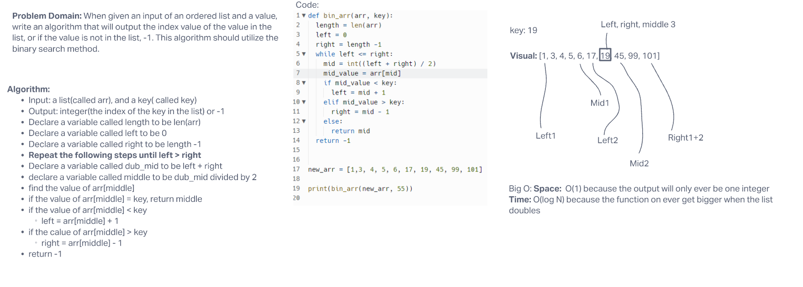

# Code Challenge 3

## Description

Write an algorithm that searches in a binary fashion through an ordered list

This search system is incredibly efficient in both time and space used. Huge amounts of data can be searched through in very little time.
