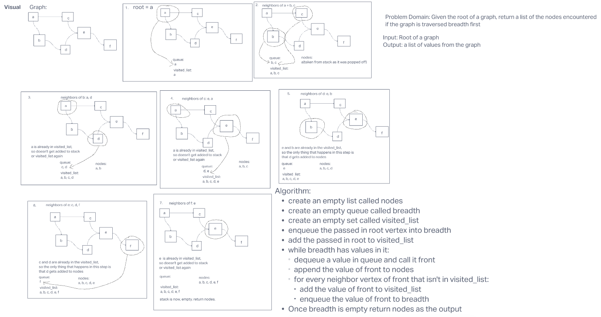

# Challenge Summary

Given the root of a graph, create a function that returns a list of values encountered when traversing the graph breadth first from the given root.

## Whiteboard Process

## Approach & Efficiency

The Big O for space for this method would be O(2N) due to the fact that for each vertex within the graph, two new discrete values will be created. One that will live first in the queue and then the returned list, and the other that will be created as the visited_list grows.

The Big O for time would be O(N) as there will only ever be as many traversals from vertex to vertex thanks to the fact that the visited_list will remove any redundant steps being made, and the enqueueing and dequeuing process will only take as many steps as there are in the graph.
