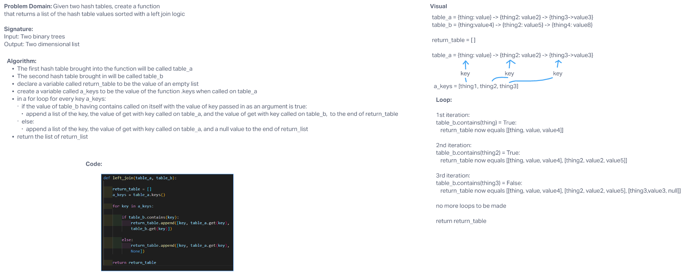

# Hashmap LEFT JOIN

## Challenge

The challenge of this challenge was to create a function that would take in two separate hashtables and return some datatype that has sorted through the tables with a left join logic.

## Approach & Efficiency

The Big O for space for this algorithm is O(N) due to the fact that at worst the return table list could have a list that was as long as the entire bredth of the data being passed in, that is to say if the table_a being passed in was the only table being passed in. At that point the return table would have as many values in it as there were items in the hashtable.

The Big O for time would be O(2N) as it would only ever have to go through the passed into the equation twice. Once to put all of the keys into the list, and twice to check every key against the keys of the table_b.

## Solution

