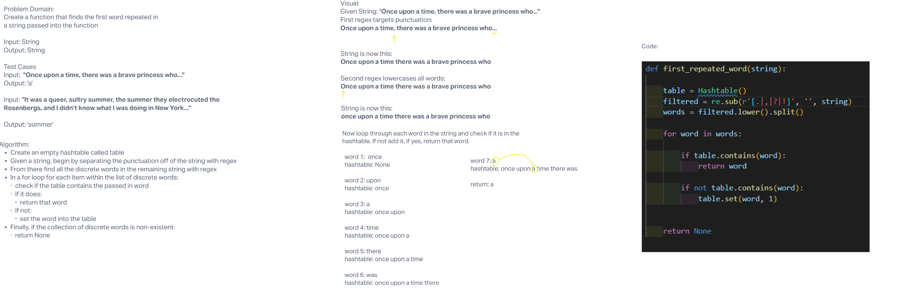

# Challenge Summary

Today's challenge was to create a function that, when given a string, would find the first repeated word in the string.

## Whiteboard Process

## Approach and Efficiency

The Big O for space for this particular function would be O(1) due to the fact that at most it would just cycle through the list once, and it would only need to have on interaction with each word in the string.

The Big O for time would also be O(1) for the same reasons.
