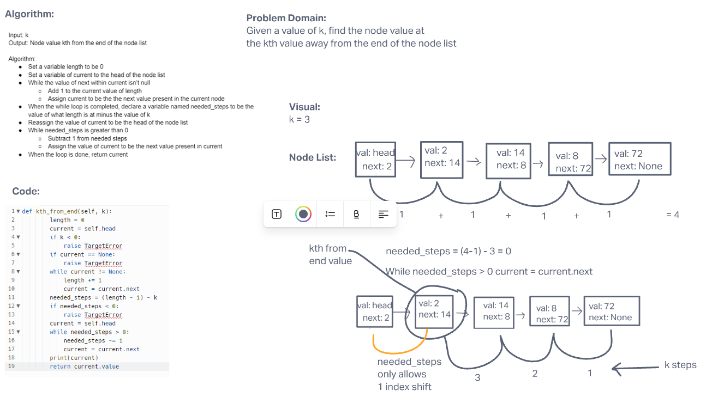

# Challenge Summary

Create a method that when fired will take in an argument, k, and return the value of the node the kth value away from the end of the node list.

## Whiteboard Process

## Approach & Efficiency

The Big O for time is O(N) because the time it takes is dependent on how far back it has to count in the linked list, and goes up at a linear rate as the values it iterates over grows.

The Big O for space is O(1) because regardless of the input you are only ever going to get out a node value.
