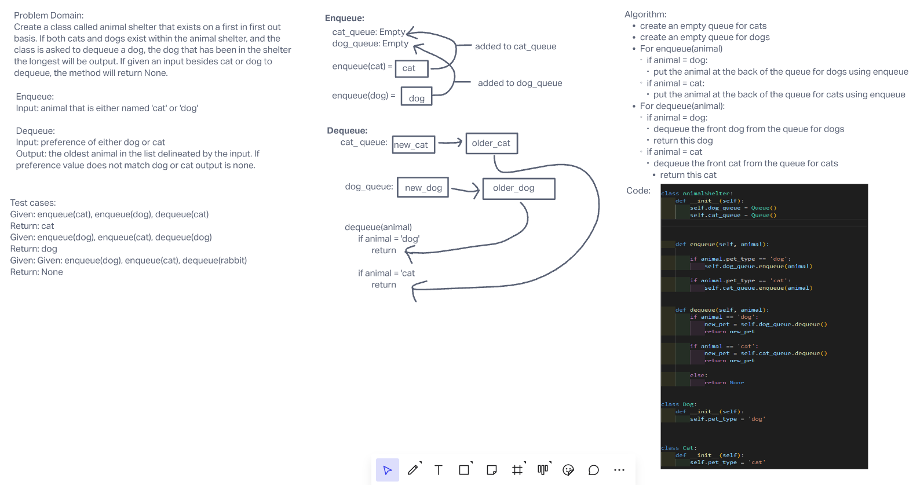

# Challenge Summary

Today's challenge was to create a class all AnimalShelter that would contain functions to be enqueue and dequeue cats and dogs. This class would work on a first in first out basis.

## Whiteboard Process

## Approach & Efficiency

Big(O) for space on enqueue would be O(1) due to the fact that it will only ever make the queue it is attacking to one value longer. Time would be a O(1) as well for the same reasons

Big(O) for space on dequeue would be O(1) because it is only ever outputting one value from the specific queue it is pulling from. Time would be the same as it is only ever pulling from the closest value of the queue.
