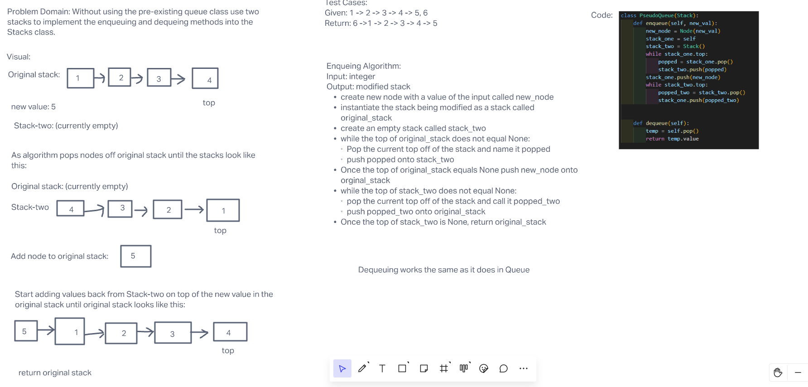

# Challenge Summary

Without using the pre-existing queue class use two stacks to implement the enqueuing and dequeing methods

## Whiteboard Process

## Approach & Efficiency

I took the slinky approach when tackling this code challenge, unloading the original stack before adding the new value to the now empty stack, and then restacking the original stack on top of the new value.

The Big(O) for time would be O(2N) due to the fact that the algorithm has to unstack and restack every element of the original stack. This would go up linearly, doubling the length of time for each item in the stack.

Big(O) for space would be O(1) because the output in the current state of the algorithm will only ever be one node length longer than the original stack.

