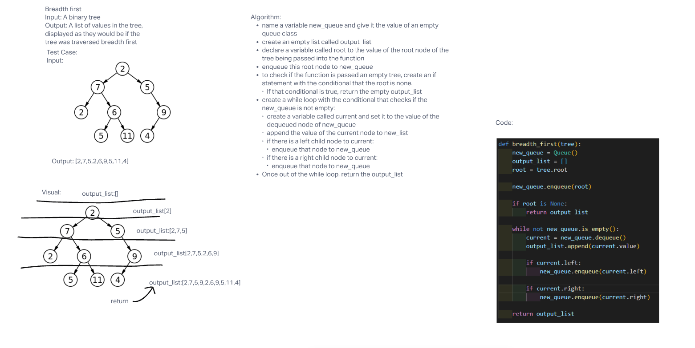

# Challenge Summary

Write a function that if given a binary tree as an argument, will return a list of the node values if traversed breadth first.

## Whiteboard Process

## Approach & Efficiency

Big O for space of this function would be O(N) because it will have as many values in the output list as the binary tree has nodes.

Big O for time will be O(N) as well because it needs to travel every node of the tree. This means the time it takes to traverse the entire tree will hae a linear relationship with how big the given input tree is.

## Solution

Run the code by following the link below to see it, and test it by using pytest on the test_breadth_first.py file

[Link to Code](python/code_challenges/tree_breadth_first.py)

