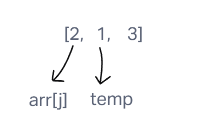
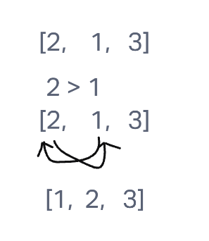

# Insertion Sort

Insertion sort is a sorting algorithm that traverses a list one time and sorts each value in the list based on how it compares to the value to the index one lower than it. If that value at the index one lower than it is larger than the value of the value that is traversing, the algorithm will put that traversing in the spot one lower on the index than it was before. The algorithm will continue to do this until the value directly lower than the traversing value is smaller than the traversing value. The algorithm then changes the traversing value to the value one higher in the index list than the most recently sorted value.

## Pseudocode

    InsertionSort(int[] arr)

      FOR i = 1 to arr.length

        int j <-- i - 1
        int temp <-- arr[i]

        WHILE j >= 0 AND temp < arr[j]
          arr[j + 1] <-- arr[j]
          j <-- j - 1

        arr[j + 1] <-- temp

## Trace

Sample Array: [2, 1, 3]

The algorithm starts by setting up a for loop for every value in the list besides the first value. Then the algorithm creates a variable named temp to be the value of the index at i. The algorithm also creates a variable of j to be equal to i - 1. Finally, the algorithm finds the value of the number at the index of j.

The algorithm then sets up a while loop that fires while both the value of j is equal to or greater than 0 and temp is smaller than the value of the list at index j. While they are both true, the algorithm then reassigns the value of temp to be lower than arr[j] in the index by one.

In the example above we can see that the temp value, 1, is now at index 0, taking it out of the while loop. The value of temp is then assigned to the index value one higher than the value of arr[j]. At this point, the list is now ordered.

## Approach and Efficiency

The Big O for time for this algorithm is O(N) as at the very worst, it would have to traverse through every item in the list, meaning that the potential time it takes is linked linearly to the potential length of the list.

The Big O for space would be O(1) because the returned list will only ever be as long as the list that is input.

## Solution

[Link to the Code](python/code_challenges/insertion_sort.py)
