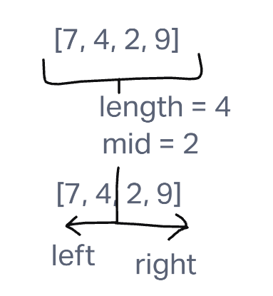
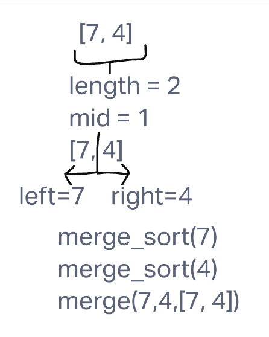
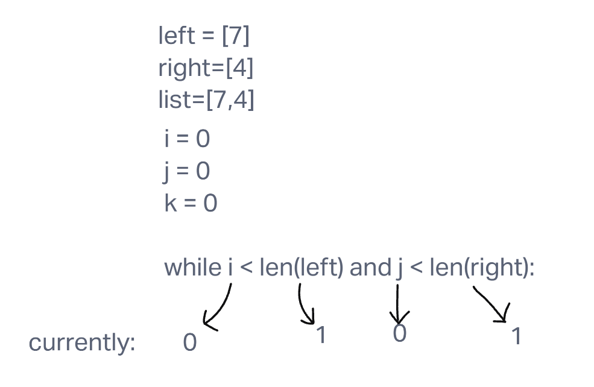
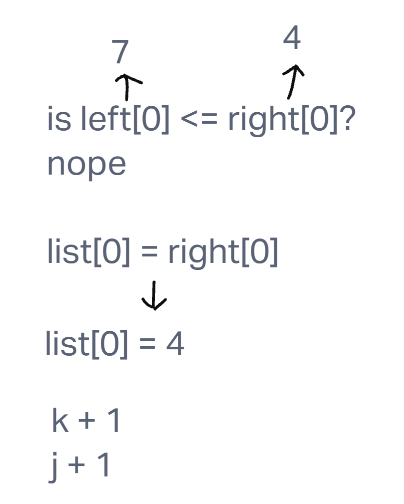

# Merge Sort

Merge sort is an algorithm for sorting arrays that progressively cuts an array into smaller and smaller halves. Once those halves are either sorted from smallest to largest or the halves are each one value long so that they may be directly compared to the other one value, the halves are then merged back together to form an ascending ordered list.

## Pseudocode

    ALGORITHM Mergesort(arr)
      DECLARE n <-- arr.length

      if n > 1
        DECLARE mid <-- n/2
        DECLARE left <-- arr[0...mid]
        DECLARE right <-- arr[mid...n]
        // sort the left side
        Mergesort(left)
        // sort the right side
        Mergesort(right)
        // merge the sorted left and right sides together
        Merge(left, right, arr)

      ALGORITHM Merge(left, right, arr)
        DECLARE i <-- 0
        DECLARE j <-- 0
        DECLARE k <-- 0

        while i < left.length && j < right.length
        if left[i] <= right[j]
            arr[k] <-- left[i]
            i <-- i + 1
        else
            arr[k] <-- right[j]
            j <-- j + 1

        k <-- k + 1

        if i = left.length
          set remaining entries in arr to remaining values in right
        else
          set remaining entries in arr to remaining values in left

## Trace

The algorithm for the function merge_sort starts by examining the list given as an argument. It calculates the length of said list, and then divides it to get the value of the variable mid. All of the values from index 0 to index mid (exclusive) are put in a new list called left, while all of the values from index mid to the end of the argument list are put in a new list called right.

The algorithm then takes the list of left and the list of right and recursively puts them in the function merge_sort. Let's first follow the process of what left goes through in this function.

Once again split into left and right, the single values are then passed back into the function. However, at the bottom of the function the left, the right, and the list variables are passed into a merge function.

The merge function begins with declaring variables of i, j, and k to all be the value of 0. These will be the index counters of left, right and the full array, respectively.

After declaring the variables of i, j, and k, the algorithm creates a while loop that will continue to loop as long as i is less than the length of left, and j is less than the length of right.

In the while loop, the algorithm first checks to see if the value of left at index i is less than or greater than the value of right at index j. In this case the value of left at index i is 7, and the index of right at j is 4, signalling the algorithm to continue on in the loop. Because that first conditional is untrue, the algorithm then reassigns232 the value of the full list passed in at index k to be the value of right at value j.Finally in this loop, the value of both k and j are increased by one.

Starting again in the while loop with the values of j and k both increased by 1, the loop goes through the same conditionals.
